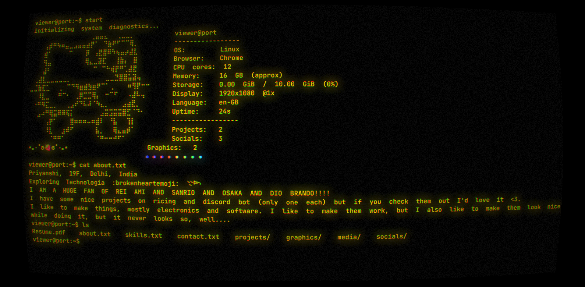

# Termanshi



I named it because it sounds nice and it's static and it's idk very fashionable and bare-metal; i love hello kitty and rei ami so there are like easters too if that helps. 

## What it is
Well clearly a portfolio website. 

## How to use this as a template
 You should be aware of the basics of forking a repo and rest personalise/customise in config.js i made so that's easier and then in filesystem.js attach your links and work it aint that tuff. 

## Customize the identity

Edit js/config.js and change:
>ownerName
> 1. hostname
> 2. welcomeMessage
> 3. siteTitle
> 4. homeDirName
if you take a fancy to >///<

Example:

```
I don't need to tell that. Do I?
```

## Customize the content

The filesystem is defined in filesystem.js. That file controls:
- folders like projects, socials, and graphics
- files shown in the terminal
- links opened by curl
- any custom text content for cat and other commands; you can check [shell commands](https://explainshell.com) here and add them. 

## Notes

- The project is intentionally styled as more like an emulation of termux.
- Open to Contributions just maintain the basic [code of conduct](https://www.contributor-covenant.org)
- Open to first contributions too since i m also a beginner ˚.⋆꒰১ ໒꒱⋆.˚
